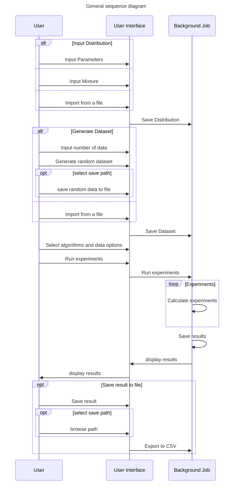

```mermaid
sequenceDiagram
   Title: General sequence diagram
   participant User
   participant UI as User Interface
   participant BG as Background Job
 
   alt Input Distribution
       User->>UI: Input Parameters
   else
       User->>UI: Input Mixture
   else
       User->>UI: Import from a file
   end
   UI->>BG: Save Distribution
 
   alt Generate Dataset
       User->>UI: Input number of data
       User->>UI: Generate random dataset
       opt select save path
           User->>UI: save random data to file
       end
   else
       User->>UI: Import from a file
   end
   UI->>BG: Save Dataset
   User->>UI:Select algorithms and data options
   User->>UI: Run experiments
   UI->>BG: Run experiments
   loop Experiments
       BG->>BG: Calculate experiments
   end
   BG->>BG: Save results
   BG->>UI: display results
   UI->>User: display results
   opt Save result to file
       User->>UI: Save result
       opt select save path
           User->>UI: browse path
       end
       UI->>BG: Export to CSV
   end
```
